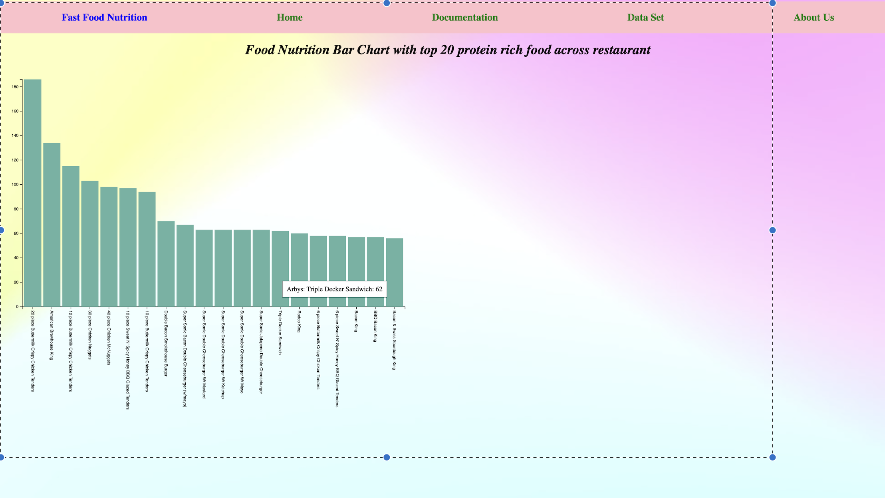
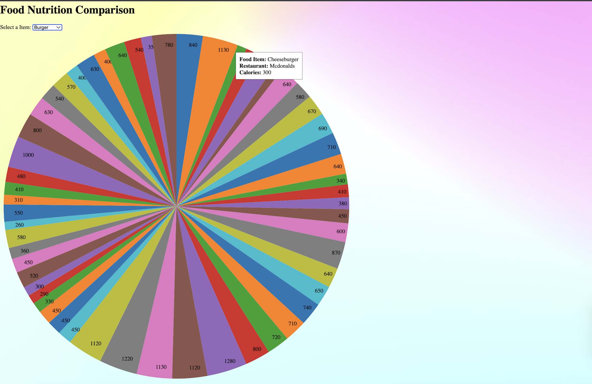
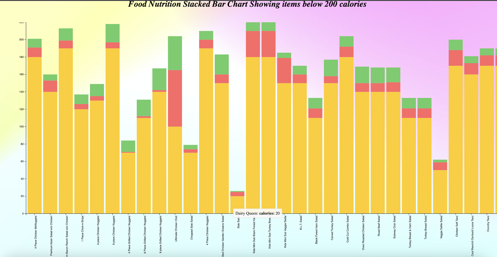
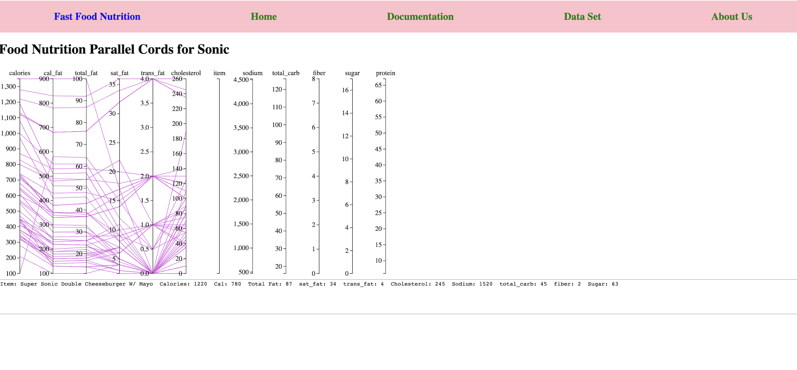

Author : Meghna Obalashetty

Technology: HTML,CSS,JS,D3.js

Introduction:
This README provides an overview of the Fast Food Nutrition Visualization Project, aimed at providing insights into the nutritional content of fast food items from popular fast food chains. The project includes various visualizations and features to help users understand and analyze the data effectively.

How Important to Know About Fastfood Nutrition?
Understanding the nutritional content of fast food is important for making informed decisions about what we eat and promoting good health.

About the Dataset:
The project utilizes the Fast Food Nutrition Dataset, which offers a detailed breakdown of the nutritional content of a wide range of fast food products from renowned fast food chains. This dataset is valuable for nutritionists, researchers, and health-conscious individuals as it sheds light on the nutritional value of fast food items, aiding in informed decision-making regarding food choices. The dataset includes information on calories, fat, carbohydrates, protein, and other essential nutrients.
• https://www.kaggle.com/datasets/ulrikthygepedersen/f astfood-nutrition

Project Features and Visualizations:

Bar Chart:

Displays the calorie content of different menu items across various fast food chains.
Enhanced Bar Graph:

Utilizes the dataset containing a variety of food items served in specific fast food restaurants along with their nutrition values.
X-axis represents the food items from respective restaurants.
Y-axis represents the calorie value of each food item.
Includes tooltip functionality to display item and calorie information clearly on hover.
Parallel Coordinates:

Shows the relationship between different columns such as total fat, calories, cholesterol, etc., using parallel cords.
Each data value corresponds to a multivariate point, and paths are drawn based on these points.
Provides an overall understanding of the nutritional composition of fast food items consumed, including fat, sugar, cholesterol, etc.
Food Item Comparison – Pie Chart:

Implements a dropdown menu containing common food items across restaurants for comparison.
Upon selecting an item from the dropdown, the respective pie chart is displayed.
Includes tooltip functionality to show restaurant item and calorie information on hover.
Facilitates comparison of particular items in terms of calorie rate across restaurants.
Stacked Bar Chart:

Displays items with 200 calories using a stacked bar chart.
Three different categories – Proteins, Carbohydrates, Calories – are displayed for each item.
Implements tooltip for enhanced user experience.

Why This Project:
The project aims to leverage the dataset's nutritional information to provide insights for nutritionists, researchers, and health-conscious individuals. By analyzing this dataset, users can better understand the nutritional impact of fast food consumption and work towards promoting healthier food options in the fast food industry. Visualization helps users identify patterns and trends in their diets, facilitating informed dietary choices and promoting healthy eating habits.

Homepage Features:

Header containing links to About Us, Dataset Access, and Documentation.
Clickable restaurant logos that redirect to their respective pages and zoom on hover.
Additional options for comparing food items across restaurants and identifying the top 20 protein-rich foods.
Restaurant Page:

After clicking on restaurant logos on the homepage, users are redirected to the respective restaurant pages.
Each restaurant page displays all food items associated with the restaurant.
Provides two types of visualizations: Bar chart and Parallel coordinates.
This README aims to provide an overview of the Fast Food Nutrition Visualization 

Project, its features, and the rationale behind its development. For further details on implementation and usage, refer to the project documentation.
  
Images:
/Users/meghnadayanand/Desktop/Meghna/final projects/Fast food Nutrition - Group 2/barchart.png

